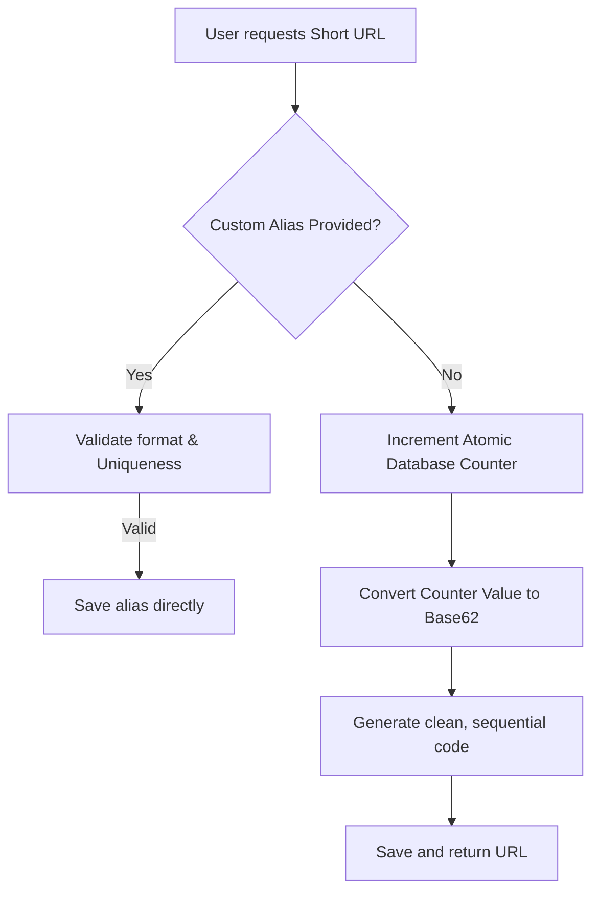

<div align="center">

# 🔗 Shrinkr

### Premium, High-Performance Base62 URL Shortener

[](https://url-shrinkr-web.vercel.app/)
[](https://dashboard.render.com)
[](https://www.mongodb.com/cloud/atlas)
[](https://opensource.org/licenses/ISC)

<br />

<a href="https://url-shrinkr-web.vercel.app/" target="_blank">
  <kbd>
    
  </kbd>
</a>

<br />
<br />

**Shrinkr** is a warm, minimalist, and high-performance URL shortener built with a modern decoupled architecture: an Express Node.js REST API backend paired with a React 19 + Vite + Tailwind CSS v4 frontend. 

It uses an **atomic sequential counter converted to Base-62** to generate collision-free shortened links, while natively supporting optional **custom short names** with backend format validation and database uniqueness checking.

</div>

---

## 🎨 Tech Stack & Highlights

<table align="center">
  <tr>
    <td width="50%" valign="top">
      <h4>📱 Frontend Client</h4>
      <ul>
        <li><b>React 19 & Vite:</b> Ultra-fast hot module reloading (HMR) and lightweight production bundles.</li>
        <li><b>Tailwind CSS v4:</b> Styled using Tailwind's compiler-driven v4 architecture with zero configuration bloat.</li>
        <li><b>Warm Minimalist Theme:</b> Customized color palette with <code>#F2F0EA</code> Cream and <code>#2C221E</code> Espresso, detailed grid overlays, and CSS checkmark success animations.</li>
        <li><b>Lucide Icons:</b> Clean, minimalist vector iconography.</li>
      </ul>
    </td>
    <td width="50%" valign="top">
      <h4>⚙️ Backend API Server</h4>
      <ul>
        <li><b>Node.js & Express:</b> Lightweight, highly responsive event-driven REST API.</li>
        <li><b>Mongoose & MongoDB Atlas:</b> Double-indexed database lookup models (<code>originalUrl</code> & <code>shortCode</code>) ensuring sub-millisecond query performance.</li>
        <li><b>Base62 Converter:</b> Bi-directional mathematical encoding logic mapping sequential integers to alphanumeric strings (e.g. <code>1000</code> → <code>g8</code>).</li>
        <li><b>Proxy Friendly:</b> Enabled trust proxy support for secure deployment behind cloud reverse-proxies.</li>
      </ul>
    </td>
  </tr>
</table>

---

## 🧠 Under the Hood: Base-62 Algorithm

Shrinkr uses a deterministic sequence generator instead of generating random string hashes (which are prone to collisions). 



### The Encoding Math
Our custom Base-62 converter uses the character set `0-9a-zA-Z` (62 possible characters) to convert sequential IDs:
$$\text{Base62 Char Set} = \{0\dots9, a\dotsz, A\dotsZ\}$$

- Counter **$1000$** encoding sequence:
  $$1000 = (16 \times 62^1) + (8 \times 62^0) \rightarrow \text{Characters at index } 16 \text{ and } 8 \rightarrow \mathbf{g8}$$
- This guarantees **maximum density** with **zero collisions** and **predictable URL length growth**.

---

## 📂 Repository Blueprint

```bash
URLshortener/
├── server/                 # Express Backend API
│   ├── config/             # DB initialization and counter setup
│   ├── controllers/        # Express controller (shrink & redirect logic)
│   ├── models/             # Mongoose Schemas (Counter.js & Url.js)
│   ├── routes/             # API routes definition
│   ├── utils/              # Base62 encoder/decoder
│   ├── .env                # Backend local environment keys (Ignored)
│   ├── server.js           # API Entry Point
│   └── clearDb.js          # Database cleanup & reset script
│
├── client/                 # React Frontend
│   ├── src/
│   │   ├── components/     # Modular layout components (Header, Form, etc.)
│   │   ├── App.jsx         # App page coordinator & fetch controller
│   │   ├── index.css       # Tailwind v4 styles, themes, and checkmark animations
│   │   └── main.jsx
│   ├── index.html          # Web page frame (with mobile viewports & SEO)
│   └── vite.config.js      # Vite compilation configurations with Tailwind
│
└── README.md               # Main Project Documentation
```

---

## 🚀 Local Development Setup

Follow these commands to get your local environment running.

### 1. Prerequisites
- [Node.js](https://nodejs.org/) installed (v18+)
- A running [MongoDB Atlas](https://www.mongodb.com/cloud/atlas) cluster (or local MongoDB database)

### 2. Configure Backend Server
```bash
# Navigate to the server folder
cd server

# Install dependencies
npm install

# Create environment file
touch .env
```

Populate the `.env` file with your details:
```env
PORT=5000
MONGO_URI=your_mongodb_connection_string
BASE_URL=http://localhost:5000
```

Start the developer server with auto-reload:
```bash
npm run dev
```

### 3. Configure Frontend Client
```bash
# Open a new terminal and navigate to client
cd client

# Install dependencies
npm install

# Start Vite build watcher
npm run dev
```
Open **`http://localhost:5173`** in your browser.

---

## 📡 REST API Reference

<details>
<summary><b>1. Shorten a URL (POST /api/url/shorten)</b></summary>

Generates a shortened path for a given destination.

- **URL:** `/api/url/shorten`
- **Method:** `POST`
- **Headers:** `Content-Type: application/json`

#### Option A: Auto-Generated Base62 URL
**Request Body:**
```json
{
  "originalUrl": "https://www.wikipedia.org"
}
```
**Response (`201 Created`):**
```json
{
  "originalUrl": "https://www.wikipedia.org",
  "shortUrl": "http://localhost:5000/g8",
  "shortCode": "g8"
}
```

#### Option B: Custom Short Name URL
**Request Body:**
```json
{
  "originalUrl": "https://www.wikipedia.org",
  "customCode": "wiki"
}
```
**Response (`201 Created`):**
```json
{
  "originalUrl": "https://www.wikipedia.org",
  "shortUrl": "http://localhost:5000/wiki",
  "shortCode": "wiki"
}
```

#### Possible Errors
| Code | Reason | Example Response |
| :--- | :--- | :--- |
| `400` | Invalid request / bad format | `{"error": "Please provide a valid HTTP or HTTPS URL"}` |
| `409` | Alias collision | `{"error": "Short code \"wiki\" is already in use."}` |

</details>

<details>
<summary><b>2. Redirect to Original URL (GET /:shortCode)</b></summary>

Redirects the browser to the original website and increments click telemetry in the background.

- **URL:** `/:shortCode`
- **Method:** `GET`
- **Response:** `301 Moved Permanently`

#### Errors
- Returns a `404 Not Found` JSON object if the requested short code does not exist:
  ```json
  { "error": "Short URL not found" }
  ```

</details>

<details>
<summary><b>3. Database Purge Utility (Optional Command)</b></summary>

For development and testing, you can purge the database and reset the counter back to starting index (`999`) by running:
```bash
cd server
node clearDb.js
```

</details>

---

## ☁️ Production Cloud Integration

This project is deployed to production using **Vercel (React client)** and **Render (Express API)**.

### Environment Mapping

To link the decoupled client and API servers, configure these environments:

```
[React on Vercel]                               [Express on Render]
VITE_API_URL: https://url-shrinkr-api... ───►   BASE_URL: https://url-shrinkr-api...
                                                MONGO_URI: mongodb+srv://...
```

> [!IMPORTANT]
> - Ensure **`BASE_URL`** on the Render (Express) backend matches the backend's own live domain (this determines the prefix of the generated short links).
> - Ensure **`VITE_API_URL`** on Vercel (React) matches your Render backend URL (no trailing slash).

---

## 📝 License

This project is open source and available under the [ISC License](LICENSE). Built with 🔗 by Rishi.
